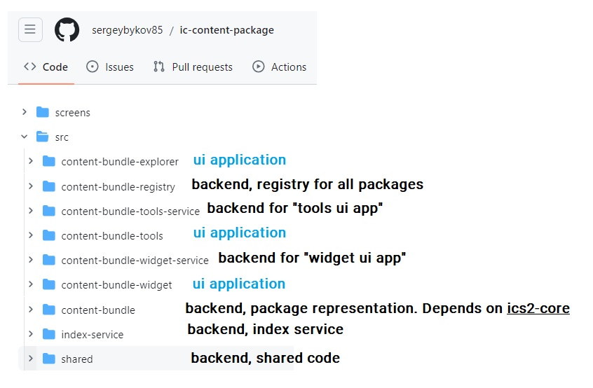

## POI Horizon
Primary goal of this project is providing a required ecosystem to store and manage POI (point of interest), query and inspect details and distribute already packaged data with a widget technique. The former name (the initial one) was just “decentalized contentt bundle”. But the concept and opportunities and plans became more wider than just “bundle”. So, it is the main reason of introuding a new name "POI Horizon". 

POI Horizon will evolve, the existing modules will get more functions and new modules will come as well. The widget will allow not only to distribute information from the ICP platform but the user will be able to operate with them, like vote on the favorite POI, choose the next “Web3 tour to launch” etc.
Let’s see some details below.

Showcase post 
https://forum.dfinity.org/t/introducing-poi-horizon-system-decentralized-backbone-for-web3-tour-and-web3-heritage-services/29266

## Key terms
**Decentralized content bundle** (or content bundle for short) – model to store various information. It is made up of one or more data groups. It is an internal term of the product.

**Package** – logical group of “bundles”. Packages are divided into public, private and shared and have various settings and limits which are specified during creation.

**Toolkit app** – UI application (frontend canister) to create/manage packages and bundles.
It is a visual entry point. It is also possible to manage packages/bundles via calling backend canisters from any programming language.

**Explorer app** – UI application to query details about any package/bundles.

**Widget app** – UI application to create/manage widgets where diffeent bundles could be included. Various widget types could be supported, more logic and options could be included

**POI** – point of interest. Any information could be represented as POI. But the initial intention is a declaration of the travel objects and related information.

**POI Horizon** – name of the ICP-based platfom. The former name (the initial one) was just “decentalized contentt bundle”. But the concept and opportunities and plans became more wider than just “bundle”. So, it is the main reason of introuding a new name

## Project highlights
Technically, POI Horizon is a set of backend services and UI applications. Right now we start from 3 visual applications, but the UI/UIX design will evolve, list of their functionalities will evolve and new modules will be added as well (frontend, backend). POI Horizon should become a “decentralized heart” of various applications.

Backend services implemented with Motoko programming language. Recently source code was updated to be compatible with dfx 0.18.0 version

Tech stack for UI apps : Node.js, TypeScript, React, Vite & Vitest, ESLint & Prettier, SCSS

## Code structure


## Architecture 
Here is a schema of existing canisters. This illustration refers to the current list of canisters and also some new possible modules mentioned as well.


A few words about each visual UI application.

**Toolkit** – application for the individual user to deploy a new package and submit new bundles. User is able to choose the proper options for its package. The package is divided into public, private and shared types. Public type means that anyone can contribute here. So, you can add new bundles into any public package. Private means that only you are authorized to work with. The shared type means that creator can work with (like a private type) and creator is allowed to apply (and modify) the list of contributors to work together. So, you can delegate the access to any identity and revoke it.
It is important to say, that even if there is a public package and you can add any new bundle here, it doesn’t mean that user is able to “touch” and edit the bundles were not created by himself

**Explore app** – application where authentication is not needed. It is a public app to check/find data, inspect any package or bundles.

**Widget app** – application for individual users to create a widget based on the supported templates and existing data. It is a way to embed “your package, your bundle(s)” or “any existing bundles” into the website. The list of supported templates will be extended from time to time based on the product needs and feedback. Also, the widget app allows to display information, execute CAT (call to action), request the user to vote on “various things” etc.


## Features 
- Deploy new package
- Update package details
- Create new bundle
- Remove empty bundle
- View bundle details, search opportunity
- Submit bundle details , delete details
- Create simple widget
- Apply options on the widget
- Widget rendering, widget items rotation, various sections inside the widget
- UI to manage package and bundles
- UI to query any data without authetication

Nearest Features
 - Management of the shared packages
 - Wizard tool for widget management.

## Installation
_The next steps belong to the backend part of the ecosystem.
Each UI application should have separate ReadMe file with some details and instructions._

```bash
-- step1. starts dfx
$ dfx start --background

-- step2. deploys package_registrry actor and take the canister id for the step3
dfx deploy package_registry --argument="(record {network = variant {Local = \"localhost:4943\"}; owner = null; index_service = null;} )";

-- step3. deploys index_sevice
dfx deploy index_service --argument="(record {network = variant {Local = \"localhost:4943\"}; operators = vec {principal \"${package_registry}\"} })";

-- step4. runs the index. Peiod is 60 second (period to check/update index)
dfx canister call index_service apply_scan_period "(60)";

-- step5. registers an index_service. Script requires a valid index_serrvice id (step3)
dfx canister call package_registry apply_index_service "(principal \"${index_service}\")";

-- step6. deploy package_service. Script requires a valid package_registry  id (step 2)
dfx deploy package_service --argument="(record {network = variant {Local = \"localhost:4943\"}; owner = null; package_registry = opt \"${package_registry}\"})";


-- step7. registers package_service as a submitter for the package_registry. Script requires a valid package_service  id (step 6)
dfx canister call package_registry register_submitter "(record {identity = record {identity_type = variant {ICP}; identity_id = \"${package_service}\"}; name = \"Bundle toolkit\"; description = \"Toolkit service to deploy and manage packages\"; urls = vec {}})";

-- step8. activates trial level for the package service
dfx canister call package_service apply_trial_allowance "(3)";

-- step9. top up canister
dfx canister deposit-cycles 9000000000000 ${package_service_id}

-- step10. deploys widget_service. Script requires a valid package_registry  id (step 2)
dfx deploy widget_service --argument="(record {network = variant {Local = \"localhost:4943\"}; owner = null; package_registry = opt \"${package_registry}\"})";

-- step11. activate trial package on the widget service
dfx canister call widget_service apply_trial_allowance "(5)";
```

## PackageRegistry actor
This actor is responsible to maintain the references of all packages. Also this actor is connected with an index actor and delegates some queries into the index

### Interface
Some public methods of the `PackageRegistry` actor:
- `register_submitter (args : Types.CommonArgs) : async Result.Result<(), CommonTypes.Errors> `: sets the identity that can register any new package. Register means just include, not create a package
- `remove_submitter (identity : CommonTypes.Identity)`: removes the identity that can register any new package. - `register_package (package : Principal, assign_creator : ?CommonTypes.Identity) : async Result.Result<Text, CommonTypes.Errors> `: includes a new package (already deployed) into the registry
- `delist_package (id : Text) : async Result.Result<Text, CommonTypes.Errors> `: excludes  the package from the registry. Delist means exclude, not delete of the package canister
- `refresh_package (package : Principal) : async Result.Result<(), CommonTypes.Errors> `: updates metadata of the package inside the registy to have a consistency between package itself and registry


## PackageService actor
This actor is responsible to represent backend service for the Toolkit App

### Interface
Some public methods of the `PackageService` actor:
- `deploy_public_package (metadata:Types.MetadataArgs, options: ?Types.PackageOptions) : async Result.Result<Text, CommonTypes.Errors>`: deploys a new public package (canister), inits its store and registers it in the registry
- `deploy_private_package (metadata:Types.MetadataArgs, options: ?Types.PackageOptions) : async Result.Result<Text, CommonTypes.Errors>`:deploys a new private package (canister), inits its store and registers it in the registry 
- `deploy_shared_package (metadata:Types.MetadataArgs, contributors:[CommonTypes.Identity], options: ?Types.PackageOptions) : async Result.Result<Text, CommonTypes.Errors>`:deploys a new shared package (canister), inits its store and registers it in the registry
- `remove_empty_package (id : Text, remainder_cycles:?Nat)`: removes the empty package physically and delists it from the registry as well

////
## BundlePackage actor
This actor is responsible to represent a package model (list of bundles).Client/service interects with BundlePackage to manage bundles. It is worth to mention that PackageService instantiate BundlePackage actor and include it into the PackageRegistry

### Interface
Some public methods of the `BundlePackage` actor:
- `update_metadata (args : Types.MetadataUpdateArgs) : async Result.Result<(), CommonTypes.Errors>`: updates metadata (name, description, logo) of the package
- `apply_contributors (access_list : [CommonTypes.Identity]) : async Result.Result<(), CommonTypes.Errors>`: applies list of contributors for shared package. 
- `register_bundle (args : Types.BundleArgs) : async Result.Result<Text, CommonTypes.Errors> `: registers a new bundle in the package. If user is not authorized, then error is returned
- `update_bundle (id: Text, args : Types.BundleUpdateArgs) : async Result.Result<Text, CommonTypes.Errors>`: updates the bundle metadata (name, description, tags, classifications)
- `apply_bundle_logo (id: Text, logo : ?Types.DataRawPayload) : async Result.Result<Text, CommonTypes.Errors>`: updates bundle logo
- `remove_empty_bundle (bundle_id: Text) : async Result.Result<Text, CommonTypes.Errors>`: removes empty bundle. Empty means the bundle without any details like POI etc. If bundle has only metadata name/description/logo it is an empty one
- `freeze_bundle (id: Text, args: Types.DataFreezeArgs) : async Result.Result<Text, CommonTypes.Errors>`: sets the readonly attribute (time in sec) for the specified group id (POI, Additions)
- `apply_bundle_section_raw (bundle_id: Text, args : Types.DataPackageRawArgs) : async Result.Result<Text, CommonTypes.Errors>`: submits the data into bundle. This method just submits raw format of the data. It is useful for image, video, audio guide, binary data
- `apply_bundle_section (bundle_id: Text, args : Types.DataPackageArgs) : async Result.Result<Text, CommonTypes.Errors>`:  submits the data into bundle. This method is designed to submit "structured" data like location, aboutt, history. Since the data has some structure, then it might be post-procesed as well (adding to  the index, etc)

- `init_datastore (cycles : ?Nat) : async Result.Result<Text, CommonTypes.Errors>`:  this method should be called upon package creation. If BundlePackage is installed by PackageService, the it takes care about that as well.
- `new_data_bucket (cycles : ?Nat) : async Result.Result<Text, CommonTypes.Errors>`:  registers a new databucket (partition of the storrage) if a new one is needed
- `get_bundle_data (bundle_id: Text, group_id:CommonTypes.DataGroupId) : async Result.Result<Conversion.DataGroupView, CommonTypes.Errors>`:  returns bundle data for the specified group
- `get_bundle_data_groups (bundle_id: Text) : async Result.Result<[CommonTypes.DataGroupId], CommonTypes.Errors>`:  returns list of data groups where data aleady submitted for the bundle
- `contribute_opportunity_for (identity:CommonTypes.Identity) : async Bool`:  checks if identity can contribute in this package
- `bundle_contribute_opportunity_for (bundle_id: Text, identity:CommonTypes.Identity) : async Bool`:  checks if identity can contribute inside the existing bundle
- `get_supported_categories (group_id:CommonTypes.DataGroupId) : async [CommonTypes.CategoryId] `:  returns supported categorries for the specified group id. In the future each package may have different schema of the allowed data
- `get_supported_groups () : async [CommonTypes.DataGroupId]`:  returns supprrted dat groups. In the future each package may have different schema of the allowed data
- `get_supported_classifications () : async [Text]`:  returns supprrted classifications for the package. In the future each package may have different schema of the allowed data


## WidgetService actor
This actor is responsible to represent backend service for the Widget App

### Interface
Some public methods of the `WidgetRegistry` actor:
- `create_widget (args : Types.WidgetCreationRequest) : async Result.Result<Text, CommonTypes.Errors> `: creates a new widget object
- `update_widget (id: Text, args : Types.WidgetUpdateArgs) : async Result.Result<Text, CommonTypes.Errors>`: updates metadata of the existing widget : name, desciption, status etc. 
- `update_widget_payload (widget_id:Text, criteria: ?Types.CriteriaArgs, options: ?Types.OptionsArgs) : async Result.Result<Text, CommonTypes.Errors>`: updates widget search criteria and options that impact to the rendering
- `remove_widget (widget_id:Text) : async Result.Result<Text, CommonTypes.Errors>`: removes widget
- ` get_widget(id:Text) : async Result.Result<Conversion.WidgetView, CommonTypes.Errors>`: returns widget details by id
- `query_widget_items (widget_id:Text) : async Result.Result<[Conversion.WidgetItemView], CommonTypes.Errors>`: returns widget items based on its search criteria
